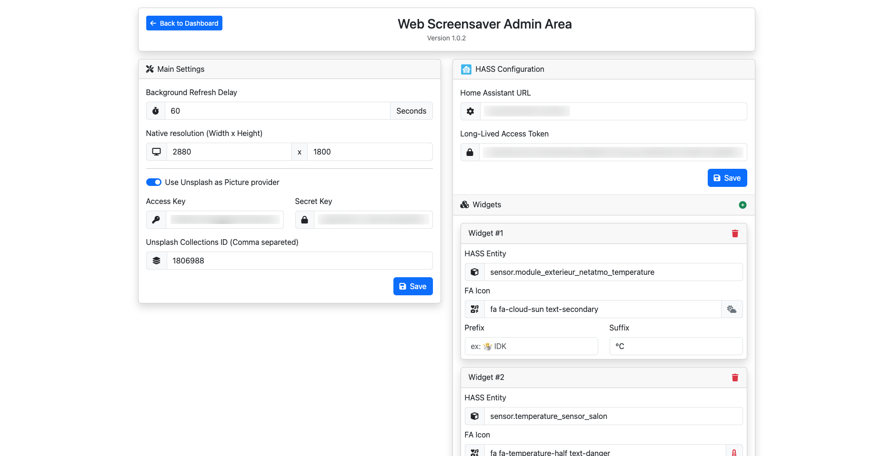

# 🖼️ Web Screensaver

Un écran de veille web moderne qui affiche une horloge élégante, des photos Unsplash et des widgets Home Assistant personnalisables. Parfait pour les tableaux de bord d'information, les écrans d'ambiance ou l'écran de veille de Fully Kiosk.

## ✨ Fonctionnalités

- 🕒 Horloge élégante avec date
- 📸 Rotation automatique de fonds d'écran via Unsplash avec choix du thème
- 🏠 Intégration avec Home Assistant
- 🎛️ Widgets personnalisables
- ⚙️ Interface d'administration intuitive
- 📱 Design responsive
- 🎨 Thème moderne

## 🚀 Installation

### Prérequis

- Docker
- Compte développeur Unsplash (Facultatif)

### Build de l'image Docker
Se placer dans le répertoire du projet:

``docker build -t web-screensaver .``

### Démarrer le container

``docker run -d -v ./api/res:/app/api/res -p 80:80 --name my-web-screensaver web-screensaver``

Le service écoute alors sur le port 8080. Vous pouvez vous y rendre via http://<IP>:8080 pour accéder au dashboard ou sur http://<IP>:8080/admin pour accéder à l'interface d'administration.

## ⚙️ Configuration

### Interface d'administration

L'interface d'administration (`/admin`) permet de configurer :

#### Paramètres principaux
- ⏱️ Délai de rafraîchissement des fonds d'écran
- 📐 Résolution native
- 🔑 Clés d'API Unsplash
- 📂 Collections Unsplash

#### Configuration Home Assistant
- 🔗 URL du serveur
- 🔑 Token d'accès longue durée
- 🎛️ Configuration des widgets
   - Entités HASS
   - Icônes FontAwesome
   - Préfixes et suffixes personnalisés

## Unsplash

Les images de fond sont récupérées depuis **Unsplash** ou, en fallback, depuis [**Picsum**](https://picsum.photos/). 

### Pourquoi Picsum ?
Picsum propose un service gratuit et illimité, contrairement à Unsplash. Cependant, Picsum offre beaucoup moins de contenu, et il n'est pas possible de personnaliser les photos récupérées.

### Utilisation d'Unsplash
Pour utiliser Unsplash, vous devez :

1. Créer un compte développeur sur [Unsplash Developers](https://unsplash.com/developers).
2. Configurer une application.  
   * **Coût** : Gratuit.  
   * **Limite** : 50 requêtes par heure.

### Optimisation via cache
Pour contourner la limite de requêtes, un système de mise en cache a été mis en place côté API de **web-screensaver** :

- Une seule requête récupère **30 images**.
- Cela permet d'obtenir jusqu'à **1 500 images par heure**, tout en restant dans la limite imposée par Unsplash.

## 🖥️ Interface utilisateur

### Dashboard (`/` or `/dashboard`)

### Admin (`/admin`)

## 📝 Notes de version

### Version 1.0.2
- ✨ Nouveau design des widgets
- 🐛 Corrections de bugs
- 🚀 Optimisation des performances

## 🤝 Contribution

Les contributions sont les bienvenues ! N'hésitez pas à :

1. Fork le projet
2. Créer une branche (`git checkout -b feature/AmazingFeature`)
3. Commit (`git commit -m 'Add AmazingFeature'`)
4. Push (`git push origin feature/AmazingFeature`)
5. Ouvrir une Pull Request

## 📜 Licence

Distribué sous la licence MIT.

## 🙏 Remerciements

- [Unsplash](https://unsplash.com) pour les magnifiques photos
- [Home Assistant](https://www.home-assistant.io/) pour leur excellente API

---

Fait avec ❤️ par Joris Bertomeu